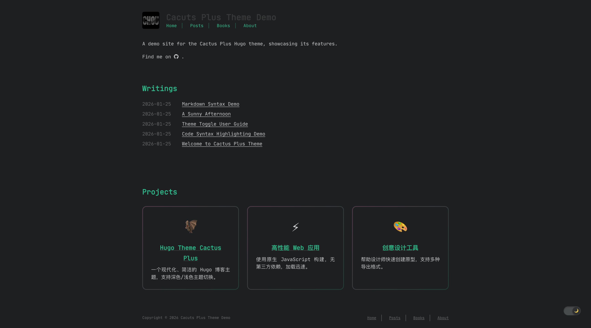
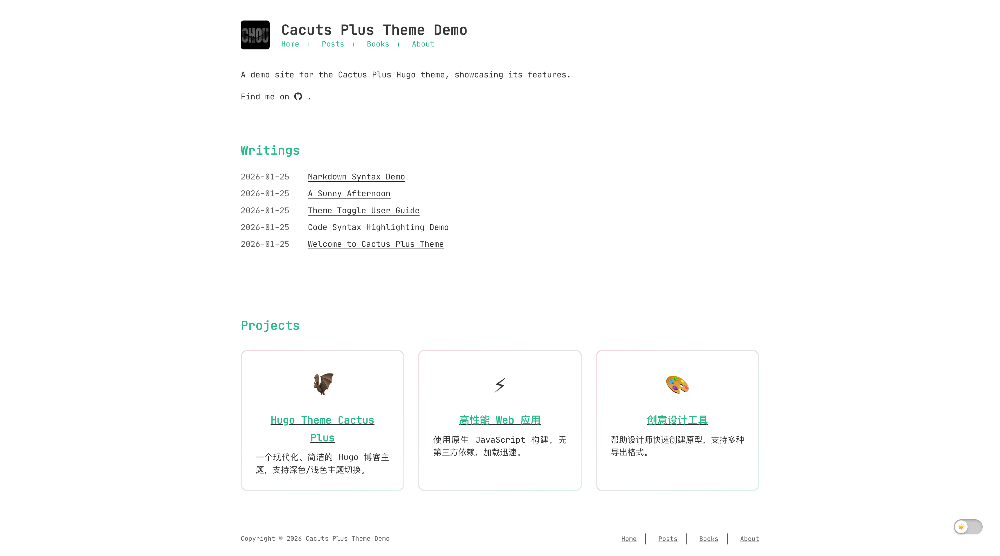

# Hugo Theme Cactus Plus

A modern, clean, and responsive Hugo theme for personal blogs with dark/light mode support.




## Features

- **Dark/Light Mode** - Toggle between color themes with persistent preference
- **Book Reviews** - Dedicated section for book reviews with ratings and reading time
- **Table of Contents** - Auto-generated, multi-level TOC with smooth scrolling
- **Responsive Design** - Optimized for desktop, tablet, and mobile
- **Syntax Highlighting** - Code blocks with copy button and line numbers
- **Comments** - Support for Disqus, Utterances, or built-in comments
- **Social Links** - Easy social media integration
- **RSS Feed** - Built-in RSS generation
- **Search** - Client-side search functionality
- **MathJax** - Mathematical formula support
- **Archive** - Chronological post listing with pagination
- **Share Buttons** - Social media sharing for posts

## Installation

1. Clone the repository to your Hugo site's `themes` directory:

```bash
git clone https://github.com/OreChou/hugo-theme-cactus-plus.git themes/cactus
```

2. Set the theme in your `config.toml`:

```toml
theme = "cactus"
```

3. Copy the example site configuration:

```bash
cp -r themes/cactus/exampleSite/* .
```

4. Start the development server:

```bash
hugo server
```

## Configuration

### Basic Settings

```toml
baseURL = "https://example.com"
languageCode = "en-us"
defaultContentLanguage = "en"
title = "Your Site Title"
theme = "cactus"
```

### Color Theme

Choose from `dark`, `light`, `white`, or `classic`:

```toml
[params]
  colortheme = "white"  # Options: dark, light, white, classic
```

### Navigation Menu

```toml
[[menu.main]]
name = "Home"
url = "/"
weight = 1

[[menu.main]]
name = "Posts"
url = "/posts"
weight = 2

[[menu.main]]
name = "Books"
url = "/books"
weight = 3

[[menu.main]]
name = "About"
url = "/about"
weight = 4
```

### Homepage Settings

```toml
[params]
  description = "Your site description"
  mainSection = "posts"
  mainSectionTitle = "Blog"
  postsOnHomePage = 5
  showAllPostsOnHomePage = false
  tagsOverview = true
  showProjectsList = true
  projectsUrl = "https://github.com/yourusername"
```

### Books Configuration

```toml
[params.books]
  booksPerPage = 20  # Books per page (supports 4-column layout on large screens)
  showRating = true
  showReadingTime = true
```

### Post Settings

```toml
[params]
  showReadTime = true
  dateFormat = "2006-01-02"
```

### Table of Contents

Configure TOC depth in your `config.toml`:

```toml
[markup.tableOfContents]
  endLevel = 4
  ordered = false
  startLevel = 2
```

### Social Links

```toml
[[params.social]]
  name = "github"
  link = "https://github.com/yourusername"

[[params.social]]
  name = "twitter"
  link = "https://twitter.com/yourusername"

[[params.social]]
  name = "email"
  link = "your@email.com"
```

### Comments

Enable comments globally:

```toml
[params.comments]
  enabled = true
  engine = "disqus"  # Options: disqus, utterances, bat_comments
```

Or enable per post in front matter:

```yaml
---
comments: true
---
```

For Disqus, set your shortname:

```toml
disqusShortname = "your-shortname"
```

For Utterances:

```toml
[params.comments]
  enabled = true
  engine = "utterances"
  repo = "yourusername/your-repo"
  theme = "github-light"
  issueTerm = "pathname"
```

### Syntax Highlighting

```toml
[markup.highlight]
  codeFences = true
  guessSyntax = false
  lineNos = true
  style = "dracula"
```

### RSS Feed

```toml
[params]
  rss = true
```

### MathJax

```toml
[params]
  mathjax = true
```

Or enable per post:

```yaml
---
mathjax: true
---
```

### Archive

Show all posts in archive without pagination:

```toml
[params]
  showAllPostsArchive = true
```

## Content Types

### Blog Posts

Create posts in `content/posts/`:

```yaml
---
title: "My Post Title"
date: 2026-01-26
draft: false
tags: ["tag1", "tag2"]
categories: ["category"]
---
```

### Books

Create book reviews in `content/books/`:

```yaml
---
title: "Book Title"
date: 2026-01-26
draft: false
author: "Author Name"
rating: 5
dateFinished: 2026-01-20
readingTime: "5h"
cover: "/images/book-cover.jpg"
amazonLink: "https://amazon.com/..."
goodreadsLink: "https://goodreads.com/..."
---

Your book review content...
```

### Projects

Create `data/projects.json`:

```json
{
  "list": [
    {
      "name": "Project Name",
      "url": "https://github.com/username/repo",
      "desc": "Project description"
    }
  ]
}
```

## Features in Detail

### Theme Toggle

Users can toggle between dark and light modes. The preference is saved in localStorage and persists across sessions.

### Book Cards

- Responsive grid: 1/2/3/4 columns based on screen size
- Cover images with placeholder fallback
- Star ratings (1-5)
- Reading time display
- Centered title and author
- Hover effects with gradient borders

### Table of Contents

- Supports up to 4 heading levels
- Compact vertical layout with left border indicators
- Hierarchical indentation
- Active section highlighting
- Smooth scroll to section
- Responsive (hidden on smaller screens)

### Code Blocks

- Syntax highlighting with Hugo
- Copy button on code blocks
- Line numbers support
- Multiple theme styles

## Customization

### Custom CSS

Add custom styles in `static/css/custom.css`:

```toml
[params]
  css = ["css/custom.css"]
```

### Favicon

Place your favicon in `static/images/favicon.ico`

### Logo

Place your logo in `static/images/logo.png`

## Deployment

### GitHub Pages

```bash
hugo -d docs
```

Then set the source to `docs` folder in repository settings.

### Netlify

Connect your repository and set the build command to `hugo`.

### Vercel

Connect your repository and set the build command to `hugo`.

## License

MIT License - see [LICENSE](LICENSE) for details.

This theme is a fork of [hugo-theme-cactus](https://github.com/monkeyWzr/hugo-theme-cactus) by Zeran Wu, which was originally based on [hexo-theme-cactus](https://github.com/probberechts/hexo-theme-cactus) by Pieter Robberechts. Both projects are licensed under the MIT License.

## Credits

- **Forked from**: [hugo-theme-cactus](https://github.com/monkeyWzr/hugo-theme-cactus) by [Zeran Wu](https://github.com/monkeyWzr)
- **Originally based on**: [hexo-theme-cactus](https://github.com/probberechts/hexo-theme-cactus) by [Pieter Robberechts](https://github.com/probberechts)
- **Icons**: [Font Awesome](https://fontawesome.com/) (CC BY 4.0)
- **Fonts**: [JetBrains Mono](https://www.jetbrains.com/lp/mono/) (OFL)
